Analysis of Casco Bay OA data through 2018 – Diurnal Patterns
================
Curtis C. Bohlen, Casco Bay Estuary Partnership

  - [Introduction](#introduction)
  - [Load Libraries](#load-libraries)
  - [Color Palette](#color-palette)
  - [Load Data](#load-data)
      - [Establish Folder References](#establish-folder-references)
      - [Read Data](#read-data)
      - [Diurnal Deviations](#diurnal-deviations)
          - [Calculate Deviations](#calculate-deviations)
  - [Analyze pCO<sub>2</sub> (Temperature Corrected) by
    Season](#analyze-pco2-temperature-corrected-by-season)
      - [Initial GAM model](#initial-gam-model)
          - [Check The Model](#check-the-model)
          - [Autocorrelation](#autocorrelation)
          - [Predictions from GAM](#predictions-from-gam)
          - [Ribbon Plot from GAM](#ribbon-plot-from-gam)
      - [Initial GAMM](#initial-gamm)
          - [Model Predictions](#model-predictions)
          - [Ribbon Graphic](#ribbon-graphic)
      - [Formal comparisons of differences between GAM spline
        fits](#formal-comparisons-of-differences-between-gam-spline-fits)
  - [Other Models](#other-models)
      - [Analysis of pH](#analysis-of-ph)
          - [Initial GAM model](#initial-gam-model-1)
          - [Check The Model](#check-the-model-1)
          - [Predictions from GAM](#predictions-from-gam-1)
          - [Ribbon Plot from GAM](#ribbon-plot-from-gam-1)
      - [Initial GAMM](#initial-gamm-1)
          - [Model Predictions](#model-predictions-1)
          - [Ribbon Graphic](#ribbon-graphic-1)
      - [Formal comparisons of differences between GAM spline
        fits](#formal-comparisons-of-differences-between-gam-spline-fits-1)


# Introduction

This notebook and related notebooks document analysis of data derived
from a multi-year deployment of ocean acidification monitoring equipment
at the Southern Maine Community College pier, in South Portland.

The monitoring set up was designed and operated by Joe Kelly, of UNH and
his colleagues, on behalf of the Casco Bay Estuary Partnership. This was
one of the first long-term OA monitoring facilities in the northeast,
and was intended to test available technologies as well as gain
operational experience working with acidification monitoring.

In this Notebook, we develop formal Generalized Additive Model analyses
of diurnal patterns, addressing autocorrelation.

# Load Libraries

``` r
library(tidyverse)  # includes readr, readxl
```

    ## -- Attaching packages --------------------------------------------------------------------------- tidyverse 1.3.0 --

    ## v ggplot2 3.3.2     v purrr   0.3.4
    ## v tibble  3.0.3     v dplyr   1.0.0
    ## v tidyr   1.1.0     v stringr 1.4.0
    ## v readr   1.3.1     v forcats 0.5.0

    ## -- Conflicts ------------------------------------------------------------------------------ tidyverse_conflicts() --
    ## x dplyr::filter() masks stats::filter()
    ## x dplyr::lag()    masks stats::lag()

``` r
library(lubridate)
```

    ## 
    ## Attaching package: 'lubridate'

    ## The following objects are masked from 'package:base':
    ## 
    ##     date, intersect, setdiff, union

``` r
library(mgcv)
```

    ## Loading required package: nlme

    ## 
    ## Attaching package: 'nlme'

    ## The following object is masked from 'package:dplyr':
    ## 
    ##     collapse

    ## This is mgcv 1.8-31. For overview type 'help("mgcv-package")'.

``` r
library(CBEPgraphics)
load_cbep_fonts()
theme_set(theme_cbep())
```

# Color Palette

For seasonal displays This is just a lists, not a function.

``` r
season_palette = c(cbep_colors()[1],
                    cbep_colors()[4],
                    cbep_colors()[2],
                    'orange')
```

# Load Data

## Establish Folder References

``` r
sibfldnm <- 'Derived_Data'
parent   <- dirname(getwd())
sibling  <- file.path(parent,sibfldnm)

fn    <- 'CascoBayOAData.csv'
fpath <- file.path(sibling,fn)
```

The following loads existing data, including a “temperature corrected”
pCO2 value based on Takahashi et al. 2002. It then collapses that data
to daily summaries.

> Takahashi, Taro & Sutherland, Stewart & Sweeney, Colm & Poisson, Alain
> & Metzl, Nicolas & Tilbrook, Bronte & Bates, Nicholas & Wanninkhof,
> Rik & Feely, Richard & Chris, Sabine & Olafsson, Jon & Nojiri,
> Yukihiro. (2002). Global sea-air CO2 flux based on climatological
> surface ocean pCO2, and seasonal biological and temperature effects.
> Deep Sea Research Part II: Topical Studies in Oceanography. 49.
> 1601-1622. 10.1016/S0967-0645(02)00003-6.

(See the “Data\_Review\_And\_Filtering” R Notebook for details on why
and how we calculated temperature-corrected pCO2 values.)

## Read Data

We add the Month and Season factor here for use in later graphics.

Note that the original time coordinate here is in UTC, not local time.
But by default, read\_csv() interprets times according to the locale,
here Eastern Standard Time or Eastern Daylight Time, depending on time
of year. I have not found an easy way to alter that behavior, but the
force\_tz() function in lubridate can fix it.

Local time is more appropriate for graphics showing the effect of time
of day on acidification parameters.

``` r
all_data <- read_csv(fpath,
                     col_types = cols(dd = col_integer(), 
                                      doy = col_integer(),
                                      hh = col_integer(),
                                      mm = col_integer(),
                                      yyyy = col_integer())) %>%
  select(c(datetime, ph, co2, co2_corr)) %>%
  mutate(datetime = force_tz(datetime, tzone = 'UTC')) %>%
  
  # Calculate local standard time coordinates
  mutate(stdtime = structure(datetime, tzone = 'Etc/GMT+5')) %>%
  mutate(yyyy  = as.numeric(format(stdtime, format = '%Y')),
         mm    = as.numeric(format(stdtime, format = '%m')),
         dd    = as.numeric(format(stdtime, format = '%d')),
         doy   = as.numeric(format(stdtime, format = '%j')),
         hh    = as.numeric(format(stdtime, format = '%H')),
         Month = factor(mm, levels=1:12, labels = month.abb)
         ) %>%
  mutate(Season = recode_factor(mm, 
                                `1`  = 'Winter',
                                `2`  = 'Winter',
                                `3`  = 'Spring',
                                `4`  = 'Spring',
                                `5`  = 'Spring',
                                `6`  = 'Summer',
                                `7`  = 'Summer',
                                `8`  = 'Summer',
                                `9`  = 'Fall',
                                `10` = 'Fall',
                                `11` = 'Fall',
                                `12` = 'Winter'
                                ))
```

## Diurnal Deviations

### Calculate Deviations

``` r
diurnal_data <- all_data %>%
  group_by(yyyy, mm, dd) %>%
  # Calculate sample sizes for each day.
  mutate(co2_n      = sum(! is.na(co2)),
         co2_corr_n = sum(! is.na(co2_corr)),
         ph_n       = sum(! is.na(ph))) %>%
  
  # Calculate centered but not scaled values, day by day.
  mutate(co2_res      = scale(co2, scale = FALSE),
         co2_corr_res = scale(co2_corr, scale = FALSE),
         ph_res       = scale(ph, scale = FALSE)) %>%
  ungroup(yyyy, mm, dd) %>%
  
  # Replace data from any days with less than 20 hours of data with NA
  mutate(co2_res      = ifelse(co2_n>=20, co2_res, NA),
         co2_corr_res = ifelse(co2_corr_n>=20, co2_corr_res, NA),
         ph_res       = ifelse(ph_n>=20, ph_res, NA)) %>%

  # Delete unnecessary data to save space
  select(-contains('_n')) %>%
  select(-c(datetime, mm, ph, co2, co2_corr))
```

# Analyze pCO<sub>2</sub> (Temperature Corrected) by Season

## Initial GAM model

We fit a simple model, that fits a GAM smoother (cyclic cubic spline) to
time of day while accounting for autocorrelation. This model does NOT
fit autocorrelated errors.

Note also that we do not include linear predictor main effects for the
seasons here. That is because we know, *a priori*, that the average
deviation from daily averages is zero, so there is intercept term.

``` r
system.time(pco2_gam <- gam(co2_corr_res ~  s(hh, by = Season, bs='cc'),
                 data = diurnal_data, , na.action = na.omit))
```

    ##    user  system elapsed 
    ##    0.37    0.01    0.39

``` r
summary(pco2_gam)
```

    ## 
    ## Family: gaussian 
    ## Link function: identity 
    ## 
    ## Formula:
    ## co2_corr_res ~ s(hh, by = Season, bs = "cc")
    ## 
    ## Parametric coefficients:
    ##              Estimate Std. Error t value Pr(>|t|)
    ## (Intercept) -0.002086   0.274528  -0.008    0.994
    ## 
    ## Approximate significance of smooth terms:
    ##                      edf Ref.df      F p-value    
    ## s(hh):SeasonWinter 4.094      8  24.27  <2e-16 ***
    ## s(hh):SeasonSpring 4.064      8  32.35  <2e-16 ***
    ## s(hh):SeasonSummer 6.125      8 246.47  <2e-16 ***
    ## s(hh):SeasonFall   6.292      8 202.30  <2e-16 ***
    ## ---
    ## Signif. codes:  0 '***' 0.001 '**' 0.01 '*' 0.05 '.' 0.1 ' ' 1
    ## 
    ## R-sq.(adj) =  0.183   Deviance explained = 18.4%
    ## GCV = 1370.6  Scale est. = 1368.9    n = 18164

### Check The Model

#### Can We Omit Main Effects?

Since our data are centered, the intercepts should be zero. Do our
results change if we omit the seasonal main effects from the model?

``` r
system.time(pco2_gam_b <- gam(co2_corr_res ~  Season + s(hh, by = Season, bs='cc'),
                 data = diurnal_data, na.action = na.omit))
```

    ##    user  system elapsed 
    ##    0.38    0.07    0.43

``` r
summary(pco2_gam_b)
```

    ## 
    ## Family: gaussian 
    ## Link function: identity 
    ## 
    ## Formula:
    ## co2_corr_res ~ Season + s(hh, by = Season, bs = "cc")
    ## 
    ## Parametric coefficients:
    ##               Estimate Std. Error t value Pr(>|t|)
    ## (Intercept)   0.001708   0.705608   0.002    0.998
    ## SeasonSpring  0.011623   0.993327   0.012    0.991
    ## SeasonSummer -0.001770   0.857471  -0.002    0.998
    ## SeasonFall   -0.013333   0.835408  -0.016    0.987
    ## 
    ## Approximate significance of smooth terms:
    ##                      edf Ref.df      F p-value    
    ## s(hh):SeasonWinter 4.094      8  24.27  <2e-16 ***
    ## s(hh):SeasonSpring 4.063      8  32.35  <2e-16 ***
    ## s(hh):SeasonSummer 6.124      8 246.43  <2e-16 ***
    ## s(hh):SeasonFall   6.292      8 202.26  <2e-16 ***
    ## ---
    ## Signif. codes:  0 '***' 0.001 '**' 0.01 '*' 0.05 '.' 0.1 ' ' 1
    ## 
    ## R-sq.(adj) =  0.183   Deviance explained = 18.4%
    ## GCV =   1371  Scale est. = 1369.2    n = 18164

``` r
rm(pco2_gam_b)
```

#### Check For Violations of Assumptions

``` r
gam.check(pco2_gam)
```

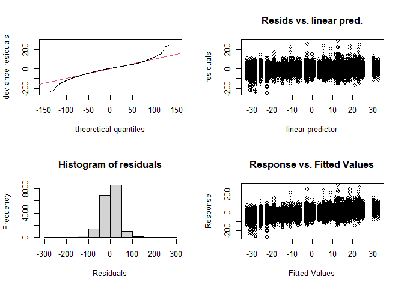<!-- -->

    ## 
    ## Method: GCV   Optimizer: magic
    ## Smoothing parameter selection converged after 5 iterations.
    ## The RMS GCV score gradient at convergence was 0.001360737 .
    ## The Hessian was positive definite.
    ## Model rank =  33 / 33 
    ## 
    ## Basis dimension (k) checking results. Low p-value (k-index<1) may
    ## indicate that k is too low, especially if edf is close to k'.
    ## 
    ##                      k'  edf k-index p-value  
    ## s(hh):SeasonWinter 8.00 4.09    0.98   0.070 .
    ## s(hh):SeasonSpring 8.00 4.06    0.98   0.110  
    ## s(hh):SeasonSummer 8.00 6.12    0.98   0.085 .
    ## s(hh):SeasonFall   8.00 6.29    0.98   0.065 .
    ## ---
    ## Signif. codes:  0 '***' 0.001 '**' 0.01 '*' 0.05 '.' 0.1 ' ' 1

### Autocorrelation

``` r
pacf(resid(pco2_gam))
```

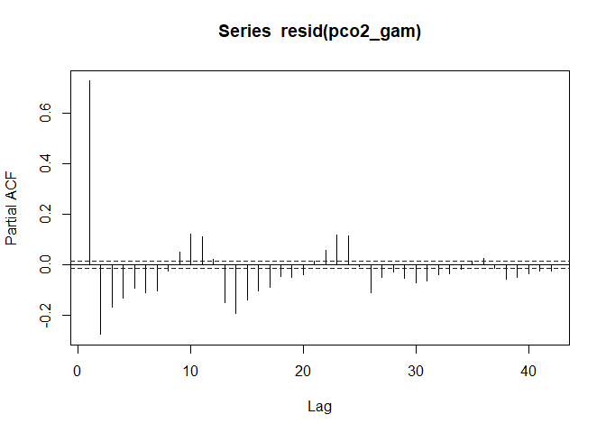<!-- -->
So, the residuals continue to be large, with an AR(1) term on the order
of 0.7. Fluctuations in autocorrelations over longer lags appear to
reflect the model, since residuals show a 24 hour periodicity.

### Predictions from GAM

``` r
newdat <- expand.grid(hh = seq(0, 23),
                    Season = c('Winter', 'Spring', 'Summer', 'Fall'))

p <- predict(pco2_gam, newdata = newdat, se.fit=TRUE)
newdat <- newdat %>%
  mutate(pred = p$fit, se = p$se.fit)
```

### Ribbon Plot from GAM

These ribbon plots show approximate 95% confidence intervals for the
spline fits by season. Here those confidence limits are deeply suspect,
because the model does not take into account autocorrelation.

``` r
ggplot(newdat, aes(x=hh, y=pred, color = Season)) + #geom_line() +
  geom_ribbon(aes(ymin = pred-(1.96*se),
                  ymax = pred+(1.96*se),
                  fill = Season), alpha = 0.5,
              color = NA) +
  
  theme_cbep(base_size= 12) +
  theme(legend.key.width = unit(0.25,"in"),
        legend.text      = element_text(size = 8)) +
  scale_fill_manual(values = season_palette, name = '') +
  
  xlab('Hour of Day') +
  ylab(expression (atop(pCO[2*(cor)]~(mu*Atm), Difference~From~Daily~Average))) 
```

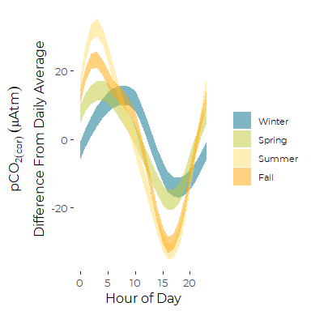<!-- -->

## Initial GAMM

We want to fit an AR1() error term. We tried using an AR(1) using the
whole data set in one block, but that crashed my computer, requiring too
much memory.

We also tried running a GAMM with an autocorrelation function set up to
depend on an hourly time stamp, but it, too took too much memory, and
crashed.

The simple autocorrelation function , which looks for correlations with
successive observations (ignoring any recorded time coordinates), would
be identical to one based on a time stamp, IF there were no missing
values.

Interestingly, it appears that the corAR1 function, when the parameter
form = NULL, does not consider missing values at all.

To reduce memory requirements, we can look for autocorrelation structure
in data subsets. Here we use look for sequential (not temporal)
autocorrelations within seasons. Since there are very few season
transitions, this should fit almost the same model as fitting a single
autocorrelation structure across the whole data set.

``` r
rm(all_data)
rm(m, p, pco2_gam)
```

    ## Warning in rm(m, p, pco2_gam): object 'm' not found

The following take \~ 15 minutes on a lightly loaded machine, and as
long as 25 min on a machine with lots of other things going on.

``` r
system.time(pco2_gam2 <- gamm(co2_corr_res ~  s(hh, by = Season, bs='cc', k=6),
                 correlation = corAR1(form = ~ 1 | Season),  # we run out of memory if we don't use a grouping
                 data = diurnal_data))
```

    ##    user  system elapsed 
    ##  718.08  190.79  940.16

``` r
summary(pco2_gam2$gam)
```

    ## 
    ## Family: gaussian 
    ## Link function: identity 
    ## 
    ## Formula:
    ## co2_corr_res ~ s(hh, by = Season, bs = "cc", k = 6)
    ## 
    ## Parametric coefficients:
    ##             Estimate Std. Error t value Pr(>|t|)
    ## (Intercept) -0.00473    0.69010  -0.007    0.995
    ## 
    ## Approximate significance of smooth terms:
    ##                      edf Ref.df      F  p-value    
    ## s(hh):SeasonWinter 3.254      4  12.06 1.18e-11 ***
    ## s(hh):SeasonSpring 3.402      4  16.26 2.51e-15 ***
    ## s(hh):SeasonSummer 3.908      4 136.78  < 2e-16 ***
    ## s(hh):SeasonFall   3.912      4 111.44  < 2e-16 ***
    ## ---
    ## Signif. codes:  0 '***' 0.001 '**' 0.01 '*' 0.05 '.' 0.1 ' ' 1
    ## 
    ## R-sq.(adj) =  0.181   
    ##   Scale est. = 1373.5    n = 18164

Note the very low overall R squared here. This simple model explains
less than one fifth of the variation in deviations from daily average
pCO<sub>2</sub>.

``` r
summary(pco2_gam2$lme)
```

    ## Linear mixed-effects model fit by maximum likelihood
    ##  Data: strip.offset(mf) 
    ##      AIC      BIC    logLik
    ##   169239 169293.6 -84612.49
    ## 
    ## Random effects:
    ##  Formula: ~Xr - 1 | g
    ##  Structure: pdIdnot
    ##              Xr1      Xr2      Xr3      Xr4
    ## StdDev: 4.789915 4.789915 4.789915 4.789915
    ## 
    ##  Formula: ~Xr.0 - 1 | g.0 %in% g
    ##  Structure: pdIdnot
    ##            Xr.01    Xr.02    Xr.03    Xr.04
    ## StdDev: 5.508025 5.508025 5.508025 5.508025
    ## 
    ##  Formula: ~Xr.1 - 1 | g.1 %in% g.0 %in% g
    ##  Structure: pdIdnot
    ##          Xr.11  Xr.12  Xr.13  Xr.14
    ## StdDev: 10.933 10.933 10.933 10.933
    ## 
    ##  Formula: ~Xr.2 - 1 | g.2 %in% g.1 %in% g.0 %in% g
    ##  Structure: pdIdnot
    ##            Xr.21    Xr.22    Xr.23    Xr.24 Residual
    ## StdDev: 10.27909 10.27909 10.27909 10.27909 37.06084
    ## 
    ## Correlation Structure: AR(1)
    ##  Formula: ~1 | g/g.0/g.1/g.2/Season 
    ##  Parameter estimate(s):
    ##      Phi 
    ## 0.726214 
    ## Fixed effects: y ~ X - 1 
    ##         Value Std.Error    DF      t-value p-value
    ## X -0.00472976 0.6900973 18163 -0.006853757  0.9945
    ## 
    ## Standardized Within-Group Residuals:
    ##        Min         Q1        Med         Q3        Max 
    ## -6.7918234 -0.5494158  0.0712751  0.5860032  7.6539644 
    ## 
    ## Number of Observations: 18164
    ## Number of Groups: 
    ##                            g                   g.0 %in% g 
    ##                            1                            1 
    ##          g.1 %in% g.0 %in% g g.2 %in% g.1 %in% g.0 %in% g 
    ##                            1                            1

The primary insight from the LME summary is that the AR1 autocorrelation
is estimated to be phi = 0.726214.

### Model Predictions

``` r
p <- predict(pco2_gam2$gam, newdata = newdat, se.fit=TRUE)
m <- predict(pco2_gam2$gam, newdata = newdat, type ='lpmatrix')
newdat <- newdat %>%
  mutate(pred2 = p$fit, se2 = p$se.fit)
```

#### Predictions are nearly identical

``` r
newdat %>%
ggplot(aes(x=pred, y=pred2)) + geom_point(aes(color=Season)) + geom_abline(aes(slope = 1,intercept = 0))
```

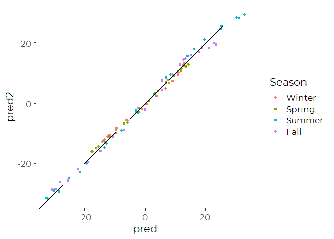<!-- -->

#### But standard Errors are different

``` r
newdat %>%
ggplot(aes(x=se, y=se2)) + geom_point(aes(color=Season)) +
  geom_abline(aes(slope = 1,intercept = 0)) +
  coord_cartesian(xlim = c(0,1.75), ylim = c(0,2.5)) +
  xlab('Standard Error\nfrom Model without Autocorrelation') +
  ylab('Standard Error\nfrom Model with Autocorrelation')
```

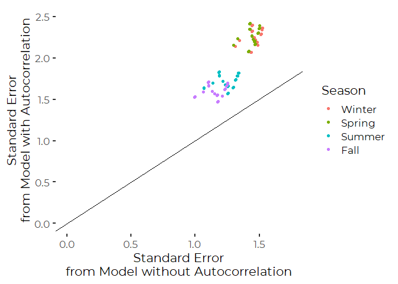<!-- -->

### Ribbon Graphic

These ribbon plots show approximate 95% confidence intervals for the
spline fits by season.

``` r
ggplot(newdat, aes(x=hh, y=pred2, color = Season)) + #geom_line() +
  geom_ribbon(aes(ymin = pred2-(1.96*se2),
                  ymax = pred2+(1.96*se2),
                  fill = Season), alpha = 0.5,
              color = NA) +
  
  theme_cbep(base_size= 12) +
  theme(legend.key.width = unit(0.25,"in"),
        legend.text      = element_text(size = 8)) +
  scale_fill_manual(values = season_palette, name = '') +
  
  xlab('Hour of Day') +
  ylab(expression (atop(pCO[2*(cor)]~(mu*Atm), Difference~From~Daily~Average))) 
```

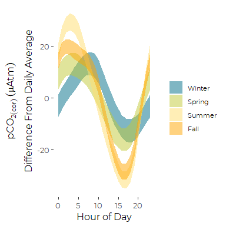<!-- -->

## Formal comparisons of differences between GAM spline fits

We follow ideas from
(here)\[<https://fromthebottomoftheheap.net/2017/10/10/difference-splines-i/>\],
which describes formal piecewise comparison of spline fits. The idea is
to manually calculate standard errors for a difference between two
estimators, here the difference between seasonal values by hour.

predict.gam returns an “lpmatrix” which \> “yields the values of the
linear predictor (minus any offset) when postmultiplied by the parameter
vector…. The latter option is most useful for getting variance estimates
for quantities derived from the model….”

That is how we use it here.

Note that the matrix is determined, in part, by the type of contrasts
used to fit the model. Since we did not specify, the default treatment
contrasts were used, comparing each level (Season) to the first level
(Winter).

An alternative approach to hypothesis testing, which uses different
model contrasts to test more holistically for differences between
prediction curves ifs presented
(here)\[<https://jacolienvanrij.com/Tutorials/GAMM.html>\].

``` r
## Which columns of m correspond to seasons of interest?
c1 <- grepl('Winter', colnames(m))
c2 <- grepl('Spring', colnames(m))
c3 <- grepl('Summer', colnames(m))
c4 <- grepl('Fall', colnames(m))

## Which rows of m correspond to seasons of interest?
r1 <- with(newdat, Season == 'Winter')
r2 <- with(newdat, Season == 'Spring')
r3 <- with(newdat, Season == 'Summer')
r4 <- with(newdat, Season == 'Fall')
```

``` r
#Example -- using matrix algebra to calculate estimates and standard errors
# Create a row vector of spline fits
mm_wsp <- m[r1,] - m[r2,]             # differences between winter and spring subparts of the matrix
mm_wsp[, ! (c1 | c2)] <- 0            # Set other columns to zero
dif <- mm_wsp %*% coef(pco2_gam2$gam) # Use Matrix multiplication to estimate

# We work with the normal distribution here, because with our huge time series
# sample sizes, the difference between the normal distribution and the
# t distribution is negligible.
se <- sqrt(rowSums((mm_wsp %*% vcov(pco2_gam2$gam, unconditional=TRUE)) * mm_wsp))
upr <- dif + (qnorm(0.975) * se)
lwr <- dif - (qnorm(0.975) * se)
```

``` r
ggplot(data = NULL, aes(x = 0:23)) +
  geom_ribbon(aes(ymin = lwr, ymax = upr), fill = cbep_colors()[1], alpha = 0.5) +
  geom_hline(yintercept = 0) +
  theme_cbep()
```

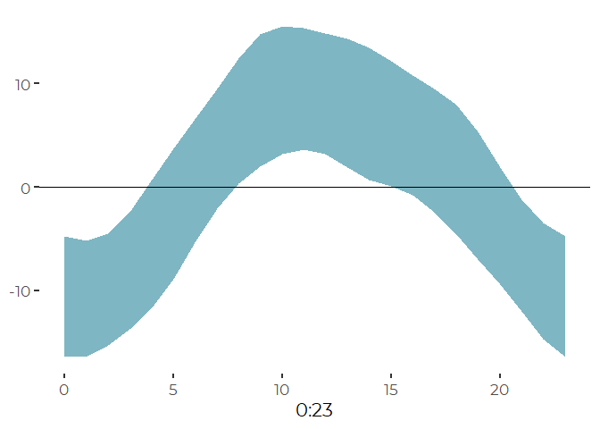<!-- --> So,
apparent differences between winter and spring diurnal patterns are
unlikely to be due to chance alone. Although one should be careful with
this analysis. This approach implicitly makes multiple hourly
comparisons, thus potentially inflating apparent statistical
significance.

Most other potential contrasts show even larger differences in diurnal
patterns. We will not produce graphics for those. The other two seasons
that provide similar values for much of the day are summer and fall, yet
even here, the patterns are clearly distinct.

``` r
mm_suf <- m[r3,] - m[r4,]
mm_suf[, ! (c3 | c4)] <- 0
dif <- mm_wsp %*% coef(pco2_gam2$gam)  # Use Matrix multiplication to estimate

se <- sqrt(rowSums((mm_suf %*% vcov(pco2_gam2$gam, unconditional=TRUE)) * mm_suf))
upr <- dif + (qnorm(0.975) * se)
lwr <- dif - (qnorm(0.975) * se)
ggplot(data = NULL, aes(x = 0:23)) +
  geom_ribbon(aes(ymin = lwr, ymax = upr), fill = cbep_colors()[1], alpha = 0.5) +
  geom_hline(yintercept = 0) +
  theme_cbep()
```

<!-- -->

# Other Models

Several other GAMMs models used up all available memory, and could not
be run. Chances are, the limited model we just ran would UNDER estimate
autocorrelation, but it’s not clear by how much. The effect would be to
make our estimates of standard errors too small.

``` r
#rm(pco2_gam2)
if (FALSE) {
  system.time(pco2_gam3 <- gamm(co2_corr_res ~  s(hh, by = Season, bs='cc', k=6),
                 correlation = corAR1(form = ~ stdtime | Month),  # we run out of memory if we don't use a grouping
                 data = diurnal_data))
}
```

## Analysis of pH

### Initial GAM model

We fit a simple model, that fits a GAM smoother (cyclic cubic spline) to
time of day while accounting for autocorrelation. This model does NOT
fit autocorrelated errors.

Note also that we do not include linear predictor main effects for the
seasons here. That is because we know, *a priori*, that the average
deviation from daily averages is zero, so there is an intercept term.

``` r
system.time(ph_gam <- gam(ph_res ~  s(hh, by = Season, bs='cc'),
                 data = diurnal_data, , na.action = na.omit))
```

    ##    user  system elapsed 
    ##    0.20    0.03    0.29

``` r
summary(ph_gam)
```

    ## 
    ## Family: gaussian 
    ## Link function: identity 
    ## 
    ## Formula:
    ## ph_res ~ s(hh, by = Season, bs = "cc")
    ## 
    ## Parametric coefficients:
    ##              Estimate Std. Error t value Pr(>|t|)
    ## (Intercept) 1.465e-06  2.775e-04   0.005    0.996
    ## 
    ## Approximate significance of smooth terms:
    ##                      edf Ref.df       F  p-value    
    ## s(hh):SeasonWinter 2.141      8   1.666 0.000342 ***
    ## s(hh):SeasonSpring 3.942      8  25.297  < 2e-16 ***
    ## s(hh):SeasonSummer 5.730      8 166.017  < 2e-16 ***
    ## s(hh):SeasonFall   6.392      8 100.048  < 2e-16 ***
    ## ---
    ## Signif. codes:  0 '***' 0.001 '**' 0.01 '*' 0.05 '.' 0.1 ' ' 1
    ## 
    ## R-sq.(adj) =  0.157   Deviance explained = 15.8%
    ## GCV = 0.00097554  Scale est. = 0.00097406  n = 12653

### Check The Model

#### Can We Omit Main Effects?

Since our data are centered, the intercepts should be zero. Do our
results change if we omit the seasonal main effects from the model?

``` r
system.time(ph_gam_b <- gam(ph_res ~  Season + s(hh, by = Season, bs='cc'),
                 data = diurnal_data, na.action = na.omit))
```

    ##    user  system elapsed 
    ##    0.25    0.00    0.31

``` r
summary(ph_gam_b)
```

    ## 
    ## Family: gaussian 
    ## Link function: identity 
    ## 
    ## Formula:
    ## ph_res ~ Season + s(hh, by = Season, bs = "cc")
    ## 
    ## Parametric coefficients:
    ##                Estimate Std. Error t value Pr(>|t|)
    ## (Intercept)  -2.878e-06  9.951e-04  -0.003    0.998
    ## SeasonSpring -8.485e-06  1.250e-03  -0.007    0.995
    ## SeasonSummer  1.495e-05  1.077e-03   0.014    0.989
    ## SeasonFall   -3.908e-06  1.105e-03  -0.004    0.997
    ## 
    ## Approximate significance of smooth terms:
    ##                      edf Ref.df       F  p-value    
    ## s(hh):SeasonWinter 2.140      8   1.665 0.000343 ***
    ## s(hh):SeasonSpring 3.942      8  25.290  < 2e-16 ***
    ## s(hh):SeasonSummer 5.730      8 165.977  < 2e-16 ***
    ## s(hh):SeasonFall   6.392      8 100.024  < 2e-16 ***
    ## ---
    ## Signif. codes:  0 '***' 0.001 '**' 0.01 '*' 0.05 '.' 0.1 ' ' 1
    ## 
    ## R-sq.(adj) =  0.157   Deviance explained = 15.8%
    ## GCV = 0.000976  Scale est. = 0.00097429  n = 12653

``` r
rm(ph_gam_b)
```

#### Check For Violations of Assumptions

``` r
gam.check(ph_gam)
```

<!-- -->

    ## 
    ## Method: GCV   Optimizer: magic
    ## Smoothing parameter selection converged after 5 iterations.
    ## The RMS GCV score gradient at convergence was 3.205132e-08 .
    ## The Hessian was positive definite.
    ## Model rank =  33 / 33 
    ## 
    ## Basis dimension (k) checking results. Low p-value (k-index<1) may
    ## indicate that k is too low, especially if edf is close to k'.
    ## 
    ##                      k'  edf k-index p-value
    ## s(hh):SeasonWinter 8.00 2.14    1.02    0.92
    ## s(hh):SeasonSpring 8.00 3.94    1.02    0.94
    ## s(hh):SeasonSummer 8.00 5.73    1.02    0.96
    ## s(hh):SeasonFall   8.00 6.39    1.02    0.90

There appears to be some structure to the residuals, and the residuals
are very heavy tailed. I would not trust standard error or P values much
coming out of this analysis. \#\#\# Autocorrelation

``` r
pacf(resid(ph_gam))
```

<!-- -->
So, the residuals continue to be large, with an AR(1) term on the order
of 0.7. Fluctuations in autocorrelations over longer lags appear to
reflect the model, since residuals show a 12/24 hour periodicity.

### Predictions from GAM

``` r
newdat <- expand.grid(hh = seq(0, 23),
                    Season = c('Winter', 'Spring', 'Summer', 'Fall'))

p <- predict(ph_gam, newdata = newdat, se.fit=TRUE)
newdat <- newdat %>%
  mutate(pred = p$fit, se = p$se.fit)
```

### Ribbon Plot from GAM

These ribbon plots show approximate 95% confidence intervals for the
spline fits by season. Here those confidence limits are deeply suspect,
because the model does not take into account autocorrelation.

``` r
ggplot(newdat, aes(x=hh, y=pred, color = Season)) + #geom_line() +
  geom_ribbon(aes(ymin = pred-(1.96*se),
                  ymax = pred+(1.96*se),
                  fill = Season), alpha = 0.5,
              color = NA) +
  
  theme_cbep(base_size= 12) +
  theme(legend.key.width = unit(0.25,"in"),
        legend.text      = element_text(size = 8)) +
  scale_fill_manual(values = season_palette, name = '') +
  
  xlab('Hour of Day') +
  ylab(expression (atop(pH, Difference~From~Daily~Average))) 
```

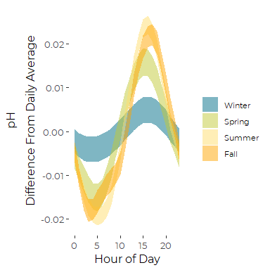<!-- -->

## Initial GAMM

We want to fit an AR1() error term. We tried using an AR(1) using the
whole data set in one block, but that crashed my computer, requiring too
much memory.

We also tried running a GAMM with an autocorrelation function set up to
depend on an hourly time stamp, but it, too took too much memory, and
crashed.

The simple autocorrelation function , which looks for correlations with
successive observations (ignoring any recorded time coordinates), would
be identical to one based on a time stamp, IF there were no missing
values.

Interestingly, it appears that the corAR1 function, when the parameter
form = NULL, does not consider missing values at all.

To reduce memory requirements, we can look for autocorrelation structure
in data subsets. Here we use look for sequential (not temporal)
autocorrelations within seasons. Since there are very few season
transitions, this should fit almost the same model as fitting a single
autocorrelation structure across the whole data set.

``` r
rm(all_data)
```

    ## Warning in rm(all_data): object 'all_data' not found

``` r
rm(p, ph_gam)
```

The following take \~ 7 minutes on a lightly loaded machine.

``` r
system.time(ph_gam <- gamm(ph_res ~  s(hh, by = Season, bs='cc', k=6),
                 correlation = corAR1(form = ~ 1 | Season),  # we run out of memory if we don't use a grouping
                 data = diurnal_data))
```

    ##    user  system elapsed 
    ##  310.50   86.62  404.41

Revising that to run off the actual time stamp did not work. It ran for
well over an hour before crashing.

``` r
summary(ph_gam$gam)
```

    ## 
    ## Family: gaussian 
    ## Link function: identity 
    ## 
    ## Formula:
    ## ph_res ~ s(hh, by = Season, bs = "cc", k = 6)
    ## 
    ## Parametric coefficients:
    ##               Estimate Std. Error t value Pr(>|t|)
    ## (Intercept) -1.043e-05  5.728e-04  -0.018    0.985
    ## 
    ## Approximate significance of smooth terms:
    ##                      edf Ref.df       F  p-value    
    ## s(hh):SeasonWinter 1.254      4   0.636    0.112    
    ## s(hh):SeasonSpring 3.196      4  15.499 4.24e-15 ***
    ## s(hh):SeasonSummer 3.840      4 104.334  < 2e-16 ***
    ## s(hh):SeasonFall   3.731      4  57.630  < 2e-16 ***
    ## ---
    ## Signif. codes:  0 '***' 0.001 '**' 0.01 '*' 0.05 '.' 0.1 ' ' 1
    ## 
    ## R-sq.(adj) =  0.155   
    ##   Scale est. = 0.00097719  n = 12653

Note the very low overall R squared here. This simple model explains
less than one fifth of the variation in deviations from daily average
pCO<sub>2</sub>.

``` r
summary(ph_gam$lme)
```

    ## Linear mixed-effects model fit by maximum likelihood
    ##  Data: strip.offset(mf) 
    ##         AIC      BIC   logLik
    ##   -57854.42 -57802.3 28934.21
    ## 
    ## Random effects:
    ##  Formula: ~Xr - 1 | g
    ##  Structure: pdIdnot
    ##                Xr1        Xr2        Xr3        Xr4
    ## StdDev: 0.00162599 0.00162599 0.00162599 0.00162599
    ## 
    ##  Formula: ~Xr.0 - 1 | g.0 %in% g
    ##  Structure: pdIdnot
    ##               Xr.01       Xr.02       Xr.03       Xr.04
    ## StdDev: 0.005139885 0.005139885 0.005139885 0.005139885
    ## 
    ##  Formula: ~Xr.1 - 1 | g.1 %in% g.0 %in% g
    ##  Structure: pdIdnot
    ##               Xr.11       Xr.12       Xr.13       Xr.14
    ## StdDev: 0.007370147 0.007370147 0.007370147 0.007370147
    ## 
    ##  Formula: ~Xr.2 - 1 | g.2 %in% g.1 %in% g.0 %in% g
    ##  Structure: pdIdnot
    ##               Xr.21       Xr.22       Xr.23       Xr.24   Residual
    ## StdDev: 0.006479537 0.006479537 0.006479537 0.006479537 0.03126001
    ## 
    ## Correlation Structure: AR(1)
    ##  Formula: ~1 | g/g.0/g.1/g.2/Season 
    ##  Parameter estimate(s):
    ##       Phi 
    ## 0.6192673 
    ## Fixed effects: y ~ X - 1 
    ##           Value    Std.Error    DF     t-value p-value
    ## X -1.043119e-05 0.0005728435 12652 -0.01820949  0.9855
    ## 
    ## Standardized Within-Group Residuals:
    ##           Min            Q1           Med            Q3           Max 
    ## -8.0131768114 -0.4487458828  0.0003289037  0.4852667225  6.6770526416 
    ## 
    ## Number of Observations: 12653
    ## Number of Groups: 
    ##                            g                   g.0 %in% g 
    ##                            1                            1 
    ##          g.1 %in% g.0 %in% g g.2 %in% g.1 %in% g.0 %in% g 
    ##                            1                            1

The primary insight from the LME summary is that the AR1 autocorrelation
is estimated to be phi = 0.726214.

### Model Predictions

``` r
p <- predict(ph_gam$gam, newdata = newdat, se.fit=TRUE)
m <- predict(ph_gam$gam, newdata = newdat, type ='lpmatrix')
newdat <- newdat %>%
  mutate(pred2 = p$fit, se2 = p$se.fit)
```

#### Predictions are nearly identical

``` r
newdat %>%
ggplot(aes(x=pred, y=pred2)) + geom_point(aes(color=Season)) + geom_abline(aes(slope = 1,intercept = 0))
```

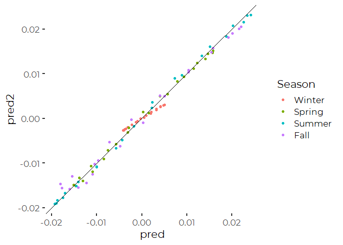<!-- -->

#### But standard Errors are different

``` r
newdat %>%
ggplot(aes(x=se, y=se2)) + geom_point(aes(color=Season)) +
  geom_abline(aes(slope = 1,intercept = 0)) +
  coord_cartesian(xlim = c(0,1.75), ylim = c(0,2.5)) +
  xlab('Standard Error\nfrom Model without Autocorrelation') +
  ylab('Standard Error\nfrom Model with Autocorrelation')
```

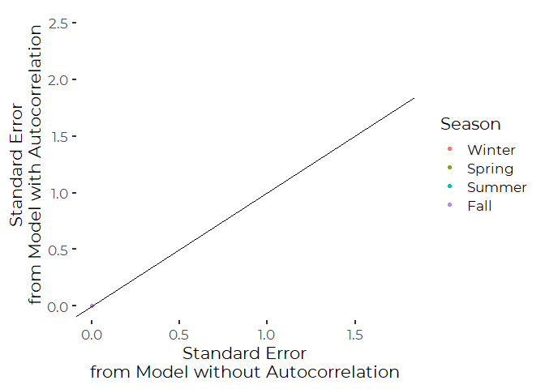<!-- -->

### Ribbon Graphic

These ribbon plots show approximate 95% confidence intervals for the
spline fits by season.

``` r
ggplot(newdat, aes(x=hh, y=pred2, color = Season)) + #geom_line() +
  geom_ribbon(aes(ymin = pred2-(1.96*se2),
                  ymax = pred2+(1.96*se2),
                  fill = Season), alpha = 0.5,
              color = NA) +
  
  theme_cbep(base_size= 12) +
  theme(legend.key.width = unit(0.25,"in"),
        legend.text      = element_text(size = 8)) +
  scale_fill_manual(values = season_palette, name = '') +
  
  xlab('Hour of Day') +
  ylab(expression (atop(pCO[2*(cor)]~(mu*Atm), Difference~From~Daily~Average))) 
```

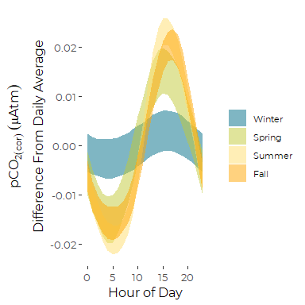<!-- -->

## Formal comparisons of differences between GAM spline fits

We follow ideas from
(here)\[<https://fromthebottomoftheheap.net/2017/10/10/difference-splines-i/>\],
which describes formal piecewise comparison of spline fits. The idea is
to manually calculate standard errors for a difference between two
estimators, here the difference between seasonal values by hour.

predict.gam returns an “lpmatrix” which \> “yields the values of the
linear predictor (minus any offset) when postmultiplied by the parameter
vector…. The latter option is most useful for getting variance estimates
for quantities derived from the model….”

That is how we use it here.

Note that the matrix is determined, in part, by the type of contrasts
used to fit the model. Since we did not specify, the default treatment
contrasts were used, comparing each level (Season) to the first level
(Winter).

An alternative approach to hypothesis testing, which uses different
model contrasts to test more holistically for differences between
prediction curves ifs presented
(here)\[<https://jacolienvanrij.com/Tutorials/GAMM.html>\].

``` r
## Which columns of m correspond to seasons of interest?
c1 <- grepl('Winter', colnames(m))
c2 <- grepl('Spring', colnames(m))
c3 <- grepl('Summer', colnames(m))
c4 <- grepl('Fall', colnames(m))

## Which rows of m correspond to seasons of interest?
r1 <- with(newdat, Season == 'Winter')
r2 <- with(newdat, Season == 'Spring')
r3 <- with(newdat, Season == 'Summer')
r4 <- with(newdat, Season == 'Fall')
```

``` r
#Example -- using matrix algebra to calculate estimates and standard errors
# Create a row vector of spline fits
mm_wsp <- m[r1,] - m[r2,]             # differences between winter and spring subparts of the matrix
mm_wsp[, ! (c1 | c2)] <- 0            # Set other columns to zero
dif <- mm_wsp %*% coef(pco2_gam2$gam) # Use Matrix multiplication to estimate

# We work with the normal distribution here, because with our huge time series
# sample sizes, the difference between the normal distribution and the
# t distribution is negligible.
se <- sqrt(rowSums((mm_wsp %*% vcov(pco2_gam2$gam, unconditional=TRUE)) * mm_wsp))
upr <- dif + (qnorm(0.975) * se)
lwr <- dif - (qnorm(0.975) * se)
```

``` r
ggplot(data = NULL, aes(x = 0:23)) +
  geom_ribbon(aes(ymin = lwr, ymax = upr), fill = cbep_colors()[1], alpha = 0.5) +
  geom_hline(yintercept = 0) +
  theme_cbep()
```

<!-- -->
So, apparent differences between winter and spring diurnal patterns are
unlikely to be due to chance alone. Although one should be careful with
this analysis. This approach implicitly makes multiple hourly
comparisons, thus potentially inflating apparent statistical
significance.

Most other potential contrasts show even larger differences in diurnal
patterns. We will not produce graphics for those. The other two seasons
that provide similar values for much of the day are summer and fall, yet
even here, the patterns are clearly distinct.

``` r
mm_suf <- m[r3,] - m[r4,]
mm_suf[, ! (c3 | c4)] <- 0
dif <- mm_wsp %*% coef(pco2_gam2$gam)  # Use Matrix multiplication to estimate

se <- sqrt(rowSums((mm_suf %*% vcov(pco2_gam2$gam, unconditional=TRUE)) * mm_suf))
upr <- dif + (qnorm(0.975) * se)
lwr <- dif - (qnorm(0.975) * se)
ggplot(data = NULL, aes(x = 0:23)) +
  geom_ribbon(aes(ymin = lwr, ymax = upr), fill = cbep_colors()[1], alpha = 0.5) +
  geom_hline(yintercept = 0) +
  theme_cbep()
```

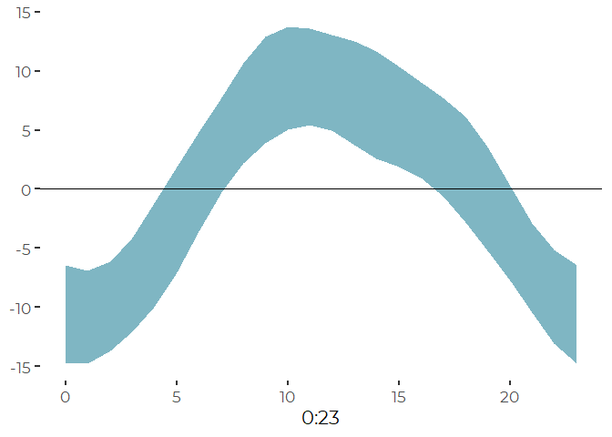<!-- -->
