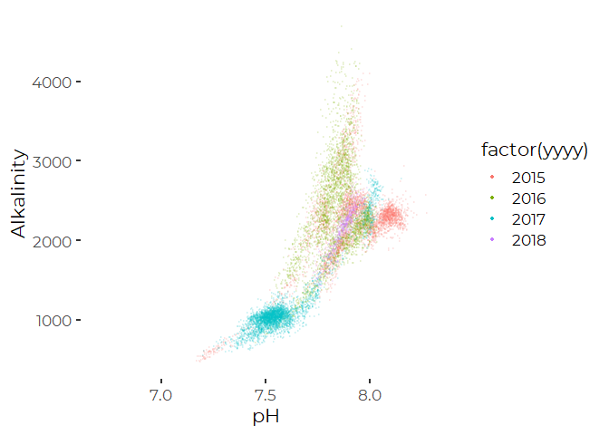
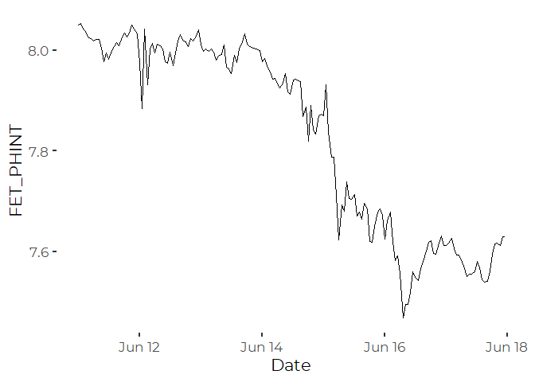
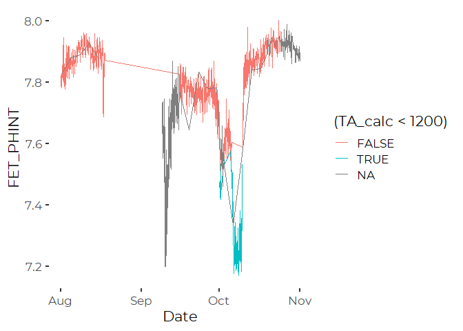
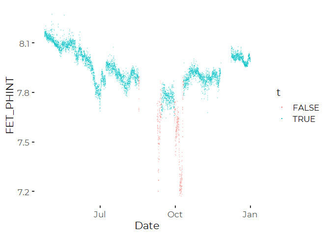
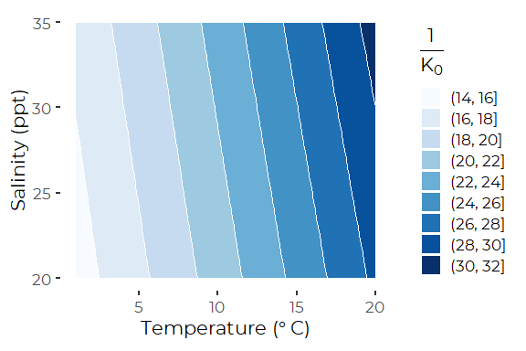

Preparation of Casco Bay OA Data
================
Curtis C. Bohlen

-   [Load Libraries](#load-libraries)
-   [Load Data](#load-data)
    -   [Establish Folder Reference](#establish-folder-reference)
    -   [Load data from identical excel spreadsheets](#load-data-from-identical-excel-spreadsheets)
    -   [Combine Data](#combine-data)
-   [Correct Errors](#correct-errors)
    -   [Demonstrate the Problem](#demonstrate-the-problem)
        -   [Drop records that have no data](#drop-records-that-have-no-data)
-   [Filtering out Bad PH Data](#filtering-out-bad-ph-data)
    -   [Graph of pH data over time](#graph-of-ph-data-over-time)
    -   [Graph of pH versus Alkalinity](#graph-of-ph-versus-alkalinity)
    -   [Graph of Alkalinity vs. Salinity](#graph-of-alkalinity-vs.-salinity)
        -   [2017](#section)
        -   [2015](#section-1)
    -   [Remove Questionable Data](#remove-questionable-data)
        -   [Show What pH Data Will be Removed](#show-what-ph-data-will-be-removed)
        -   [Remove Unwanted Data](#remove-unwanted-data)
    -   [One additinal point](#one-additinal-point)
-   [Data Cleanup](#data-cleanup)
-   [Temperature Corrected pCO2](#temperature-corrected-pco2)
    -   [What do those equations imply?](#what-do-those-equations-imply)
    -   [Takehashi et al. 2002 Relationships](#takehashi-et-al.-2002-relationships)
        -   ["Expected pCO<sub>2</sub>" at Observed Temperature](#expected-pco2-at-observed-temperature)
        -   ["Temperature Corrected" pCO<sub>2</sub>](#temperature-corrected-pco2-1)
    -   [Calculation of Temperature Corrected pCO<sub>2</sub>](#calculation-of-temperature-corrected-pco2)
-   [Output Cleaned Data](#output-cleaned-data)


Load Libraries
==============

``` r
library(tidyverse)
```

    ## -- Attaching packages ------------------------------------------------------------------------- tidyverse 1.3.0 --

    ## v ggplot2 3.3.2     v purrr   0.3.4
    ## v tibble  3.0.1     v dplyr   1.0.0
    ## v tidyr   1.1.0     v stringr 1.4.0
    ## v readr   1.3.1     v forcats 0.5.0

    ## -- Conflicts ---------------------------------------------------------------------------- tidyverse_conflicts() --
    ## x dplyr::filter() masks stats::filter()
    ## x dplyr::lag()    masks stats::lag()

``` r
library(readxl)
library(CBEPgraphics)

load_cbep_fonts()
```

Load Data
=========

Establish Folder Reference
--------------------------

``` r
sibfldnm <- 'Original_Data'
parent   <- dirname(getwd())
sibling  <- file.path(parent,sibfldnm)
```

Load data from identical excel spreadsheets
-------------------------------------------

This code retains only the median hourly values. The code generates a list containing a separate dataframe for each deployment. These lists will be collapsed into a single dataframe in the next code block.

``` r
the_data <- list()
for (yr in c(2015, 2016, 2017, 2018)) {
  fn <- paste0('CascoBay_lvl3_',  yr ,'.xls')
  fpath <- file.path(sibling,fn)
  df <- read_excel(fpath, col_types = 'numeric',
                   sheet = 'Data')[-1,] %>%  # dropping garbage second line
  select(- contains('_min')) %>%
  select(- contains('_mean')) %>%
  select(- contains('_max')) %>%
  select(- contains('_std'))
  n <- names(df)
  n <- sub('_median', '', n)
  names(df) <- n
  the_data <- append(the_data, list(df))  #  add datframe to a list of dataframes. 
}
```

Combine Data
------------

``` r
the_data <- bind_rows(the_data) %>%
  select(-yyyymmdd, -Matlab_datenum, -FET_TEMP_CON) %>%
  mutate(datetime = ISOdatetime(yyyy, mm, dd, hh,0,0, 'America/New_York')) %>%
  mutate(doy = as.numeric(strftime(datetime, format = "%j")))
```

Correct Errors
==============

In downstream analysis steps, We uncovered duplicate dates and times, but al lduiplicate rows lack data, specifically from January of 2016. We filter them out here.

Demonstrate the Problem
-----------------------

``` r
the_data %>% select(datetime) %>% group_by(datetime) %>% summarize(n = n()) %>% filter(n>1) %>% arrange(datetime)
```

    ## `summarise()` ungrouping output (override with `.groups` argument)

    ## # A tibble: 475 x 2
    ##    datetime                n
    ##    <dttm>              <int>
    ##  1 2016-01-01 00:00:00     2
    ##  2 2016-01-01 01:00:00     2
    ##  3 2016-01-01 02:00:00     2
    ##  4 2016-01-01 03:00:00     2
    ##  5 2016-01-01 04:00:00     2
    ##  6 2016-01-01 05:00:00     2
    ##  7 2016-01-01 06:00:00     2
    ##  8 2016-01-01 07:00:00     2
    ##  9 2016-01-01 08:00:00     2
    ## 10 2016-01-01 09:00:00     2
    ## # ... with 465 more rows

### Drop records that have no data

``` r
the_data <-  the_data %>% filter(
   ! (
     is.na(SBE37_TEMP) &
     is.na(SBE37_CON) &
     is.na(SBE37_SALINITY) &
     is.na(SAMICO2_TEMP) &
     is.na(SAMI_CO2) &
     is.na(Optode_O2) &
     is.na(FET_PHINT) &
     is.na(FET_PHEXT) &  
     is.na(`omega-a`) &
     is.na(`omega-c`) &
     is.na(TA_calc) &    
     is.na(DIC_calc)
   )
)
```

Filtering out Bad PH Data
=========================

Larry Harris (of the University of Maine) was a coauthor on a poster based on these data for the "Gulf of Maine 2050" conference, held in Portland, Maine in 2019. He pointed out to his coauthors (including CBEP staff) that certain pH observations appear unreliable. Many low pH values look suspect, especially in 2017. THese data do not match the QA/QC samples collected during periodic site visits. Since QA/QC samples are infrequent, some judgment is required to decide which observations to exclude from further analysis.

Sudden drops in pH to unlikely levels are one potential sign of problems wit hthe data. Another sign is if the calculated alkalinity associated with a low pH observation is unreasonable for sea water (say below about 1000).

We explore these problems graphically.

Graph of pH data over time
--------------------------

``` r
plt <- ggplot(the_data, aes(datetime, FET_PHINT)) +
  geom_point(aes(color = TA_calc), alpha = 0.05) +
  xlab('Date') +
  ylab('pH') +
  theme_cbep()
plt
```

    ## Warning: Removed 8224 rows containing missing values (geom_point).

 I note low pH excursions in 2015, perhaps 2016, and most of 2017. But note that the fist "spike" of low values in 2015 lack alkalinity calculations, presumably because other required data was not available.

Graph of pH versus Alkalinity
-----------------------------

(Note that since calculated alkalinity is only possible when all other data is available, this graph omits a lot of observations, including some low pH values.)

``` r
plt <- ggplot(the_data, aes(FET_PHINT, TA_calc, color = factor(yyyy))) +
  geom_point(alpha = 0.1, size = 0.5) +
  xlab('pH') +
  ylab('Alkalinity') +
  theme_cbep() +
   guides(colour = guide_legend(override.aes = list(alpha = 1, size = 1)))
plt
```

    ## Warning: Removed 14131 rows containing missing values (geom_point).

 The most obvious problematic data (with very low alkalinity AND very low pH) are from 2015 and 2017.

Graph of Alkalinity vs. Salinity
--------------------------------

``` r
plt <- ggplot(the_data, aes(SBE37_SALINITY, TA_calc, color = factor(yyyy))) +
  geom_point(alpha = 0.2, size = 1)  +
  xlab('Salinity') +
  ylab('Alkalinity') +
  guides(colour = guide_legend(override.aes = list(alpha = 1, size = 4))) +
  scale_x_continuous(limits = c(22,32)) +
  theme_cbep()
plt
```

    ## Warning: Removed 14139 rows containing missing values (geom_point).

 Again, what jumps out are the points with low pH in 2017 and 2015. Although the HIGH alkalinity observations from early in 2017 also look off-base.

If we look at a plot of pH versus temperature, the same points jump out, with possibly some other low pH observations from 2016.

``` r
plt <- ggplot(the_data, aes(SBE37_TEMP, FET_PHINT, color = factor(yyyy))) +
  geom_point(alpha = 0.1) +
  theme_cbep() +
  theme(panel.grid.major = element_blank(),
        panel.grid.minor = element_blank()) +
  xlab('Temperature (C)') +
    ylab('pH') +
  guides(colour = guide_legend(override.aes = list(alpha = 1)))
plt
```

    ## Warning: Removed 8289 rows containing missing values (geom_point).

 I see no obvious way to eliminate the erroneous data. There are "bad" data popping up several times. It's mostly the 2017 data, but there may also be problematic data in 2015 and 2016.

### 2017

Identify the date in 2017 when things went wonky.

``` r
plt <- the_data %>% filter(yyyy==2017, mm == 6, dd<18, dd>10) %>%
  ggplot(aes(x=datetime, y=FET_PHINT)) + geom_line() +
  theme_cbep() +
  xlab('Date')
plt
```

 The pH drop off kicks in around June 14th. or 15th.

So, things went odd around June 14th.

### 2015

``` r
plt <- the_data %>% filter(yyyy==2015, mm %in% c(8,9,10)) %>%
  ggplot(aes(x=datetime, y=FET_PHINT)) + 
  geom_line(aes(color=(TA_calc<1200)))+
  theme_cbep() +
  xlab('Date')
plt
```



That shows a low pH period, in September around end of September 8 through Sept 14. The period may actually have started just before the data gap, around August 17th. A second period of low pH falls around September 30 through October 11. The exact period we should remove from the data here is somewhat arbitrary. Since the primary indicator of problematic data is the low observed pH value, we risk biasing results. Here we back that up by tossing out data by whole days, and by focusing on days with low calculated alkalinity.

Remove Questionable Data
------------------------

Remove questionable pH values and ALSO CO2Sys calculated values

``` r
d1 <- ISOdatetime(2015,8, 17,0,0, 0,'America/New_York')
d2 <- ISOdatetime(2015,9,14,0,0, 0,'America/New_York')
d3 <- ISOdatetime(2015,9,30,0,0, 0,'America/New_York')
d4 <- ISOdatetime(2015,10,11,0,0, 0,'America/New_York')
d5 <- ISOdatetime(2017,6,14,0,0, 0,'America/New_York')
d6 <- ISOdatetime(2017,12,31,0,0,0,'America/New_York')
phomitflag1  <- ! (the_data$datetime < d1 | the_data$datetime > d2)
phomitflag2  <- ! (the_data$datetime < d3 | the_data$datetime > d4)
phomitflag3  <- ! (the_data$datetime < d5 | the_data$datetime > d6)
flag <- ! (phomitflag1 | phomitflag2 | phomitflag3)
rm(phomitflag1, phomitflag2, phomitflag3)
```

### Show What pH Data Will be Removed

``` r
tt <- the_data %>%  mutate(t = flag) %>% filter(yyyy==2015)

plt <- ggplot(tt, aes(x=datetime, y=FET_PHINT)) +
  geom_point(aes(color = t),size = 0.5, alpha = 0.2) +
  theme_cbep() +
  xlab('Date') +
  guides(colour = guide_legend(override.aes = list(alpha = 1)))
plt
```

    ## Warning: Removed 830 rows containing missing values (geom_point).



``` r
rm(tt)
```

We are still left with some low values, but the really wonky sudden pH changes are removed.

### Remove Unwanted Data

TO trim the data, we use the flags to set to NA any variables that depend on accurate pH values, and then toss out any data that lacks remaining valid observations.

``` r
trimmed_data <- the_data %>%
  mutate(FET_PHINT = ifelse(flag, FET_PHINT, NA)) %>%
  mutate(FET_PHEXT = ifelse(flag, FET_PHEXT, NA)) %>%
  mutate(`omega-a` = ifelse(flag, `omega-a`, NA)) %>%
  mutate(`omega-c` = ifelse(flag, `omega-c`, NA)) %>%
  mutate(TA_calc = ifelse(flag, TA_calc, NA)) %>%
  mutate(DIC_calc = ifelse(flag, DIC_calc, NA)) %>%
  filter_all(any_vars(!is.na(.)))
```

One additinal point
-------------------

There is a single point that is recorded as being collected on January 20, 2016, which appears to be an error in several dimensions. First, the instrument was dedeployed right around that time, and this value is 25 hours after the prior observation. Temperature is sky high for JAnuary, and th epH is unreasonably low.

``` r
arow <- which.min(the_data$FET_PHINT)
the_data[(arow-3):(arow+2),]
```

    ## # A tibble: 6 x 18
    ##    yyyy    mm    dd    hh SBE37_TEMP SBE37_CON SBE37_SALINITY SAMICO2_TEMP
    ##   <dbl> <dbl> <dbl> <dbl>      <dbl>     <dbl>          <dbl>        <dbl>
    ## 1  2016     1    19    14       4.00     2.83           30.0          NA  
    ## 2  2016     1    19    15       3.63     2.81           29.9          NA  
    ## 3  2016     1    19    16       3.13     2.71           29.4          NA  
    ## 4  2016     1    20    17      16.1      0.262           1.66         NA  
    ## 5  2016     6     2    17      13.5      3.59           29.6          14.6
    ## 6  2016     6     2    18      14.5      3.61           29.2          14.6
    ## # ... with 10 more variables: SAMI_CO2 <dbl>, Optode_O2 <dbl>, FET_PHINT <dbl>,
    ## #   FET_PHEXT <dbl>, `omega-a` <dbl>, `omega-c` <dbl>, TA_calc <dbl>,
    ## #   DIC_calc <dbl>, datetime <dttm>, doy <dbl>

``` r
nrow(the_data)
```

    ## [1] 24686

``` r
the_data <- the_data[-arow,]
nrow(the_data)
```

    ## [1] 24685

Data Cleanup
============

Just to neaten up rename everything, and drop data we won't use.

``` r
trimmed_data <- trimmed_data %>%
  select(-SBE37_CON,
         -SAMICO2_TEMP,
         -FET_PHEXT,
         -DIC_calc
         ) %>%
  rename(doy = doy,
         temp = SBE37_TEMP,
         sal = SBE37_SALINITY,
         co2 = SAMI_CO2,
         do = Optode_O2,
         ph = FET_PHINT,
         omega_a = `omega-a`,
         omega_c = `omega-c`
  )
```

Temperature Corrected pCO2
==========================

It turns out pCO<sub>2</sub> is not a simple measure of the concentration (or activity) of CO<sub>2</sub> in water, as it is strongly influenced by temperature. Even at a fixed concentration of CO<sub>2</sub> in seawater, there will be fluctuations in pCO<sub>2</sub> due only to changes in temperature.

Here is an informal argument for why this is true: At higher temperatures, CO<sub>2</sub> is less soluble in sea water. At equilibrium, partitioning of CO<sub>2</sub> between atmosphere and ocean water will shift more CO<sub>2</sub> to the atmosphere, thus raising the partial pressure of CO<sub>2</sub> in the atmosphere that equilibrates with the CO<sub>2</sub> in the water.

More formally, carbon dioxide (gas) in the atmosphere is in thermodynamic equilibrium with \[CO<sub>2</sub>\] in the water, (where \[CO<sub>2</sub>\] here (by convention) refers to the sum of activities of CO<sub>2</sub> and H<sub>2</sub>CO<sub>3</sub> in solution.

$$CO\_{2(g)}
\\stackrel {K\_{0}} {\\longleftrightarrow} 
\[CO\_{2(aq.)}\] $$

Thus at equilibrium,

*f**C**O*<sub>2</sub> = \[*C**O*<sub>2(*a**q*.)</sub>\]/*K*<sub>0</sub>

where *f**C**O*<sub>2</sub>, the *fugacity* of CO<sub>2</sub>, is "virtually equal to the partial pressure." Unfortunately, *K*<sub>0</sub> is not constant, but depends on temperature and salinity. One semi-empirical model for that relationship is the following (From Weiss 1974 but also presented elsewhere):

*l**n* *K*<sub>0</sub> = −60.2409 + 93.4517(100/*T*)+23.3585 × *l**n*(*T*/100)+*S* \* \[0.023517 − 0.023656 \* (*T*/100)+0.0047036 \* (*T*/100)<sup>2</sup>\]

(Note that temperatures need to be expressed in Kelvin)

> Weiss, RF. 1974. Carbon dioxide in water and seawater: the solubility of a non-ideal gas. Marine chemistry 2 (3), 203-215.

What do those equations imply?
------------------------------

Here we make a graph that shows the magnitude of the conversion factor (1/*K*<sub>0</sub>), which converts from observed *p**C**O*<sub>2</sub> ≈ *f**C**O*<sub>2</sub> to \[*C**O*<sub>2</sub>\] (from the last equation, above) over the range of temperatures and salinities we are mostly concerned with. This shows how measured pCO<sub>2</sub> will vary based on temperature and salinity changes alone -- even without actual changes in the concentration of CO<sub>2</sub>.

``` r
Tc <- seq(1,20,0.5) 
S <- seq(20,35, 0.5)

test <- expand.grid(Tc=Tc, S=S) %>%
  mutate(T = Tc+273.15) %>%
  mutate(lnK = -60.2409 +
                 9345.17/T +
                 23.3585 * log(T/100) +
              S * (0.023517 - 
                   0.023656 * (T/100) + 
                   0.0047036 *(T/100)^2)) %>%
  mutate(K=exp(lnK), invK = 1/K)

ggplot(test, aes(x=Tc, y=S, z=invK)) +
  geom_contour_filled(color='white') +
  theme_cbep() +
  scale_fill_brewer(name = expression(frac(1, K[0]))) +
  xlab(expression('Temperature ('*degree~C*')')) +
  ylab('Salinity (ppt)')
```



So, over the range of temperatures and salinities we are considering, the effect is mostly due to temperature -- if only because temperatures vary over ~ 20 C, while salinities vary only from ~ 25 ppt to about 32 ppt. The overall effect of temperature and salinity could lead to a change in observed pCO<sub>2</sub> of about a factor of two even in the absence of processes that change the concetration of CO<sub>2</sub> in the Bay.

Takehashi et al. 2002 Relationships
-----------------------------------

Here we follow a formula for calculating a "Temperature Corrected" pCO<sub>2</sub>, which is derived from methods in Takehashi et al. 2002. The "temperature corrected" version adjusts for the themodynamic effect of temperature on pCO<sub>2</sub> just discusssed.

> Takahashi, Taro & Sutherland, Stewart & Sweeney, Colm & Poisson, Alain & Metzl, Nicolas & Tilbrook, Bronte & Bates, Nicholas & Wanninkhof, Rik & Feely, Richard & Chris, Sabine & Olafsson, Jon & Nojiri, Yukihiro. (2002). Global sea-air CO2 flux based on climatological surface ocean pCO2, and seasonal biological and temperature effects. Deep Sea Research Part II: Topical Studies in Oceanography. 49. 1601-1622. 10.1016/S0967-0645(02)00003-6.

Takahashi et al. 2002 Used direct calculation of "temperature corrected" pCO<sub>2</sub> as a surrogate for changes in CO<sub>2</sub> concentration, and conversely, estimates of "expected" thermal pCO<sub>2</sub>, as estimates of the magnitude of the fluctuations in pCO<sub>2</sub> one would expect to see due to temperature alone, if there were no changes in \[CO<sub>2</sub>\].

The Takehashi et al. 2002 equations are as follows:

#### "Expected pCO<sub>2</sub>" at Observed Temperature

(*p**C**O*<sub>2</sub> at *T*<sub>*o**b**s*</sub>)=(*p**C**O*<sub>2</sub>)<sub>*o**b**s*</sub> × *e**x**p*(0.0423(*T*<sub>*o**b**s*</sub> − *T*<sub>*m**e**a**n*</sub>)

#### "Temperature Corrected" pCO<sub>2</sub>

(*p**C**O*<sub>2</sub> at *T*<sub>*m**e**a**n*</sub>)=(*p**C**O*<sub>2</sub>)<sub>*o**b**s*</sub> × *e**x**p*(0.0423(*T*<sub>*m**e**a**n*</sub> − *T*<sub>*o**b**s*</sub>)

This is approach addresses the thermal dependence of pCO<sub>2</sub> by calculating what the observed pCO<sub>2</sub> would have been at some reference temperature (rather than estimating \[CO<sub>2</sub>\] as Weiss did). Here we use 12<sup>∘</sup>*C* as our reference temperature.

Equations from Takehashi et al. 2002 do not LOOK similar to Weiss's equations, but they are nearly equivalent. At fixed salinity near full sea water, they essentially differ only by a constant.

Calculation of Temperature Corrected pCO<sub>2</sub>
----------------------------------------------------

``` r
(t_ref = 12)
```

    ## [1] 12

``` r
(t_mean = mean(trimmed_data$temp, na.rm=TRUE))
```

    ## [1] 11.49428

``` r
(co2_mean = mean(trimmed_data$co2, na.rm=TRUE))
```

    ## [1] 578.2843

``` r
trimmed_data <- trimmed_data %>%
  mutate(co2_thermal =  round(co2_mean*exp(0.0423*(temp-t_mean)),2)) %>%
  mutate(co2_corr =  round(co2*exp(0.0423*(t_ref-temp)),2))
```

Output Cleaned Data
===================

``` r
write_csv(trimmed_data,'CascoBayOAData.csv')
```
