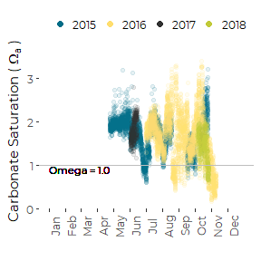
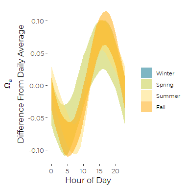

Analysis of Casco Bay OA. Still More Revised Graphics
================
Curtis C. Bohlen, Casco Bay Estuary Partnership

  - [Introduction](#introduction)
  - [Load Libraries](#load-libraries)
  - [Generate Color Palettes](#generate-color-palettes)
      - [Monthly](#monthly)
      - [Seasonal](#seasonal)
  - [Constants for Axis Labels](#constants-for-axis-labels)
  - [Load Data](#load-data)
      - [Establish Folder References](#establish-folder-references)
      - [Read Data](#read-data)
  - [Color Palette For Seasonal
    Displays](#color-palette-for-seasonal-displays)
  - [Seasonal Profiles](#seasonal-profiles)
      - [Aragonite Saturation State](#aragonite-saturation-state)
  - [Diurnal Ribbon Plot](#diurnal-ribbon-plot)
      - [Calculate Omega Deviations](#calculate-omega-deviations)
      - [Run the GAMM](#run-the-gamm)
      - [Generate Predictions from the
        Model](#generate-predictions-from-the-model)
      - [Create Ribbon Graphic](#create-ribbon-graphic)


# Introduction

This notebook and related notebooks document exploratory data analysis
of data derived from a multi-year deployment of ocean acidification
monitoring equipment at the Southern Maine Community College pier, in
South Portland.

The monitoring set up was designed and operated by Joe Kelly, of UNH and
his colleagues, on behalf of the Casco Bay Estuary Partnership. This was
one of the first long-term OA monitoring facilities in the northeast,
and was intended to test available technologies as well as gain
operational experience working with acidification monitoring.

In this Notebook, we develop more revised graphics as options for Casco
Bay Estuary partnership’s 2020 **State of Casco Bay** report. We focus
on reformatting graphics related to aragonite saturation.

# Load Libraries

``` r
library(tidyverse)
```

    ## -- Attaching packages ------------------------------------------------------------------------------------ tidyverse 1.3.0 --

    ## v ggplot2 3.3.2     v purrr   0.3.4
    ## v tibble  3.0.3     v dplyr   1.0.2
    ## v tidyr   1.1.2     v stringr 1.4.0
    ## v readr   1.3.1     v forcats 0.5.0

    ## -- Conflicts --------------------------------------------------------------------------------------- tidyverse_conflicts() --
    ## x dplyr::filter() masks stats::filter()
    ## x dplyr::lag()    masks stats::lag()

``` r
library(lubridate)
```

    ## 
    ## Attaching package: 'lubridate'

    ## The following objects are masked from 'package:base':
    ## 
    ##     date, intersect, setdiff, union

``` r
library(mgcv)
```

    ## Loading required package: nlme

    ## 
    ## Attaching package: 'nlme'

    ## The following object is masked from 'package:dplyr':
    ## 
    ##     collapse

    ## This is mgcv 1.8-33. For overview type 'help("mgcv-package")'.

``` r
library(CBEPgraphics)
load_cbep_fonts()

library(RColorBrewer)
#display.brewer.all(n=9, type="seq", exact.n=TRUE, colorblindFriendly = TRUE)
```

# Generate Color Palettes

## Monthly

To display data by months in complex graphics, we want a 12 item
sequential color palette that’s color-blind and reproduction friendly.

The rColorBrewer colorRampPalette() function creates a FUNCTION that
takes the number of colors, and returns a suitable color ramp, based on
another (usually shorter) color ramp. Note getPalette is a FUNCTION.
We’ll use this function later to generate the colors we want on the
fly.

``` r
# generates a palette function from an existing color ramp
getPalette = colorRampPalette(brewer.pal(9, "YlGnBu")[2:9])  
```

## Seasonal

This is just a list, not a function like cbep\_colors().

``` r
season_palette = c(cbep_colors()[1],
                    cbep_colors()[4],
                    cbep_colors()[2],
                    'orange')
```

# Constants for Axis Labels

``` r
monthlengths <-  c(31,28,31, 30,31,30,31,31,30,31,30,31)
cutpoints    <- c(0, cumsum(monthlengths)[1:12])[1:12]
```

# Load Data

## Establish Folder References

``` r
sibfldnm <- 'Derived_Data'
parent   <- dirname(getwd())
sibling  <- file.path(parent,sibfldnm)

fn    <- 'CascoBayOAData.csv'
fpath <- file.path(sibling,fn)

dir.create(file.path(getwd(), 'figures'), showWarnings = FALSE)
```

The following loads existing data, including a “temperature corrected”
pCO<sub>2</sub> value based on Takehashi et al. 2002. It then collapses
that data to daily summaries.

> Takahashi, Taro & Sutherland, Stewart & Sweeney, Colm & Poisson, Alain
> & Metzl, Nicolas & Tilbrook, Bronte & Bates, Nicholas & Wanninkhof,
> Rik & Feely, Richard & Chris, Sabine & Olafsson, Jon & Nojiri,
> Yukihiro. (2002). Global sea-air CO2 flux based on climatological
> surface ocean pCO<sub>2</sub>, and seasonal biological and temperature
> effects. Deep Sea Research Part II: Topical Studies in Oceanography.
> 49. 1601-1622. 10.1016/S0967-0645(02)00003-6.

(See the “Data\_Review\_And\_Filtering” R Notebook for details on why
and how we calculated temperature-corrected pCO<sub>2</sub> values.)

## Read Data

Note this version adjusts dates and times for Eastern Standard Time. It
also assigns each observation to a season based on month of the year.

``` r
all_data <- read_csv(fpath,
                     col_types = cols(dd = col_integer(), 
                                      doy = col_integer(),
                                      hh = col_integer(),
                                      mm = col_integer(),
                                      yyyy = col_integer())) %>%
  select(c(datetime, temp, sal, do, omega_a)) %>%
  mutate(datetime = force_tz(datetime, tzone = 'UTC')) %>%
  
  # Calculate local standard time coordinates
  mutate(stdtime = structure(datetime, tzone = 'Etc/GMT+5')) %>%
  mutate(yyyy  = as.numeric(format(stdtime, format = '%Y')),
         mm    = as.numeric(format(stdtime, format = '%m')),
         dd    = as.numeric(format(stdtime, format = '%d')),
         doy   = as.numeric(format(stdtime, format = '%j')),
         hh    = as.numeric(format(stdtime, format = '%H')),
         Month = factor(mm, levels=1:12, labels = month.abb)
         ) %>%
  mutate(Season = recode_factor(mm, 
                                `1`  = 'Winter',
                                `2`  = 'Winter',
                                `3`  = 'Spring',
                                `4`  = 'Spring',
                                `5`  = 'Spring',
                                `6`  = 'Summer',
                                `7`  = 'Summer',
                                `8`  = 'Summer',
                                `9`  = 'Fall',
                                `10` = 'Fall',
                                `11` = 'Fall',
                                `12` = 'Winter'
                                ))
```

# Color Palette For Seasonal Displays

This is just a list, not a function like cbep\_colors().

``` r
season_palette = c(cbep_colors()[1],
                    cbep_colors()[4],
                    cbep_colors()[2],
                    'orange')
```

# Seasonal Profiles

Only three changes here compared to the original draft graphics:

1.  The colors have been reordered to simplify making the colors
    correspond to the same years as in the FOCB graphics and
2.  The Y axis Legend has been simplified slightly.
3.  We have reformatted teh graphic to be smaller, to fit into design
    location on page layout.

## Aragonite Saturation State

``` r
plt <- ggplot(all_data, aes(doy, omega_a)) +
  geom_point(aes(color = factor(yyyy)), alpha = 0.1) +
  
  geom_hline(aes(yintercept = 1), lty = 'solid', color = 'gray') +
  geom_text(aes(x=0, y=0.9, label= 'Omega = 1.0', hjust = 0), size=3) +
  
  xlab('') +
  ylab(expression('Carbonate Saturation (' ~ Omega[a] ~ ')')) +
  
  scale_color_manual(values=cbep_colors(), name='Year') +
  scale_x_continuous(breaks = cutpoints, labels = month.abb) +
  
  guides(colour = guide_legend(override.aes = list(alpha = 1, size = 2))) +
  
  theme_cbep(base_size = 11) +
  
  theme(axis.text.x=element_text(angle=90, vjust = 1.1)) +
  
  theme(legend.title =element_blank(), 
        legend.spacing.x = unit(.075, 'cm'),
        legend.position = 'top')
  
plt
```

    ## Warning: Removed 17567 rows containing missing values (geom_point).

<!-- -->

``` r
#ggsave('figures/omegaSeasonal_cbep_smaller.png', type = 'cairo',
#       width = 3, height = 3)
ggsave('figures/omegaSeasonal_cbep_smaller.pdf', device=cairo_pdf,
       width = 3, height = 3)
```

    ## Warning: Removed 17567 rows containing missing values (geom_point).

# Diurnal Ribbon Plot

This is a new “Omega” diurnal plot, in case we want a graphic that slots
into the same location and style as the one we’ve already got.

This is an interesting graphic, but would be confusing to readers, as
the point of omega is its absolute value, not its diurnal fluctuation,
so we won’t use this in SOCB 2020.

Besides, the lack of any winter omega data means this does not look much
like the pH and PCO<sub>2</sub> versions.

## Calculate Omega Deviations

For temperature-corrected pCO<sub>2</sub>.

``` r
diurnal_data <- all_data %>%
  group_by(yyyy, mm, dd) %>%
  # Calculate sample sizes for each day.
  mutate(omega_a_n      = sum(! is.na(omega_a))) %>%
  
  # Calculate centered but not scaled values, day by day.
  mutate(omega_a_res      = scale(omega_a, scale = FALSE)) %>%
  ungroup(yyyy, mm, dd) %>%
  
  # Replace data from any days with less than 20 hours of data with NA
  mutate(omega_a_res      = ifelse(omega_a_n>=20, omega_a_res, NA)) %>%

  # Delete unnecessary data to save space
  select(-contains('_n')) %>%
  select(c(stdtime, yyyy, Season, Month, dd, hh, omega_a_res))
```

## Run the GAMM

The following takes \~ 8 minutes on a lightly loaded computer (Windows
10, 64 bit, Intel i7 processor, 2.4 GHz), and as long as 25 minutes when
the machine had lots of other things going on.

``` r
system.time(omega_gam <- gamm(omega_a_res ~  s(hh, by = Season, bs='cc', k=6),
                 correlation = corAR1(form = ~ 1 | Season),  # we run out of memory if we don't use a grouping
                 data = diurnal_data))
```

    ##    user  system elapsed 
    ##   49.70    9.92   59.66

## Generate Predictions from the Model

``` r
newdat <- expand.grid(hh = seq(0, 23),
                    Season = c('Winter', 'Spring', 'Summer', 'Fall'))
p <- predict(omega_gam$gam, newdata = newdat, se.fit=TRUE)
```

    ## Warning in predict.gam(omega_gam$gam, newdata = newdat, se.fit = TRUE): factor
    ## levels Winter not in original fit

``` r
newdat <- newdat %>%
  mutate(pred = p$fit, se = p$se.fit)
```

## Create Ribbon Graphic

The ribbon plot shows approximate 95% confidence intervals for the GAMM
fits by season.

``` r
ggplot(newdat, aes(x=hh, y=pred, color = Season)) + #geom_line() +
  geom_ribbon(aes(ymin = pred-(1.96*se),
                  ymax = pred+(1.96*se),
                  fill = Season), alpha = 0.5,
              color = NA) +
  
  theme_cbep(base_size= 12) +
  theme(legend.key.width = unit(0.25,"in"),
        legend.text      = element_text(size = 8)) +
  scale_fill_manual(values = season_palette, name = '') +
  
  xlab('Hour of Day') +
  ylab(expression(atop(Omega[a],Difference~From~Daily~Average)))
```

    ## Warning in max(ids, na.rm = TRUE): no non-missing arguments to max; returning -
    ## Inf

<!-- -->

``` r
# ggsave('figures/omega_diurnal_seasons.pdf', device = cairo_pdf,
#   width = 4, height = 4)
```
