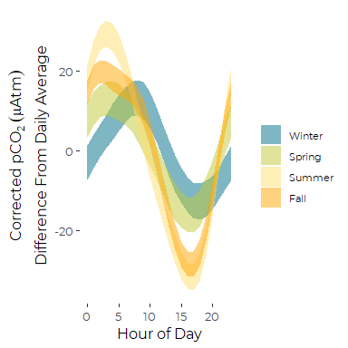
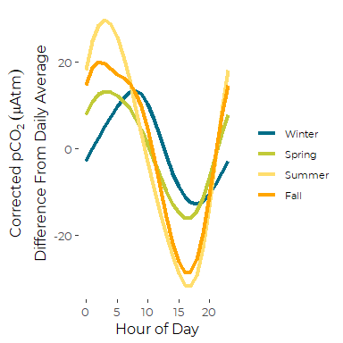
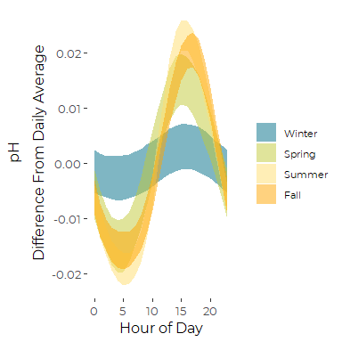

Analysis of Casco Bay OA data through 2018 – Revised Diurnal Graphics
================
Curtis C. Bohlen, Casco Bay Estuary Partnership

  - [Introduction](#introduction)
  - [Load Libraries](#load-libraries)
  - [Color Palette For Seasonal
    Displays](#color-palette-for-seasonal-displays)
  - [Load Data](#load-data)
      - [Establish Folder References](#establish-folder-references)
      - [Dealing with Time Zones](#dealing-with-time-zones)
      - [Read the Data](#read-the-data)
      - [Confirm Timezone Corrections](#confirm-timezone-corrections)
  - [pCO<sub>2</sub> Graphics (Temperature Corrected) by
    Season](#pco2-graphics-temperature-corrected-by-season)
      - [Calculate pCO<sub>2</sub>
        Deviations](#calculate-pco2-deviations)
      - [Run the GAMM](#run-the-gamm)
      - [Generate Predictions from the
        Model](#generate-predictions-from-the-model)
      - [Create Ribbon Graphic](#create-ribbon-graphic)
      - [Alternate Graphic with Lines](#alternate-graphic-with-lines)
  - [pH Graphics by Season](#ph-graphics-by-season)
      - [Calculate pH Deviations](#calculate-ph-deviations)
      - [Run the GAMM](#run-the-gamm-1)
      - [Generate Predictions from the
        Model](#generate-predictions-from-the-model-1)
      - [Create Ribbon Graphic](#create-ribbon-graphic-1)
      - [Alternate Graphic with Lines](#alternate-graphic-with-lines-1)


# Introduction

This notebook and related notebooks document analysis of data derived
from a multi-year deployment of ocean acidification monitoring equipment
at the Southern Maine Community College pier, in South Portland.

The monitoring set up was designed and operated by Joe Kelly, of UNH and
his colleagues, on behalf of the Casco Bay Estuary Partnership. This was
one of the first long-term OA monitoring facilities in the northeast,
and was intended to test available technologies as well as gain
operational experience working with acidification monitoring.

In this Notebook, we develop graphics looking at diurnal patterns of
pCO<sub>2</sub> and pH, for Casco Bay Estuary partnership’s 2020 State
of the Bay report. Companion R Notebooks in the Analysis Folder look in
greater detail at model selection and uncertainty.

# Load Libraries

``` r
library(tidyverse)  # includes readr, readxl and lubridate
```

    ## -- Attaching packages ---------------------------------------------------------------------------------------------- tidyverse 1.3.0 --

    ## v ggplot2 3.3.2     v purrr   0.3.4
    ## v tibble  3.0.3     v dplyr   1.0.0
    ## v tidyr   1.1.0     v stringr 1.4.0
    ## v readr   1.3.1     v forcats 0.5.0

    ## -- Conflicts ------------------------------------------------------------------------------------------------- tidyverse_conflicts() --
    ## x dplyr::filter() masks stats::filter()
    ## x dplyr::lag()    masks stats::lag()

``` r
library(lubridate)
```

    ## 
    ## Attaching package: 'lubridate'

    ## The following objects are masked from 'package:base':
    ## 
    ##     date, intersect, setdiff, union

``` r
library(mgcv)
```

    ## Loading required package: nlme

    ## 
    ## Attaching package: 'nlme'

    ## The following object is masked from 'package:dplyr':
    ## 
    ##     collapse

    ## This is mgcv 1.8-31. For overview type 'help("mgcv-package")'.

``` r
library(CBEPgraphics)
load_cbep_fonts()
theme_set(theme_cbep())
```

# Color Palette For Seasonal Displays

This is just a list, not a function like cbep\_colors().

``` r
season_palette = c(cbep_colors()[1],
                    cbep_colors()[4],
                    cbep_colors()[2],
                    'orange')
```

# Load Data

The following code loads data already cleaned and reorganized, via the
“Data\_Review\_And\_Filtering” R Notebook. The data includes a
“temperature corrected” pCO2 value based on Takehashi et al. 2002.

> Takahashi, Taro & Sutherland, Stewart & Sweeney, Colm & Poisson, Alain
> & Metzl, Nicolas & Tilbrook, Bronte & Bates, Nicholas & Wanninkhof,
> Rik & Feely, Richard & Chris, Sabine & Olafsson, Jon & Nojiri,
> Yukihiro. (2002). Global sea-air CO2 flux based on climatological
> surface ocean pCO2, and seasonal biological and temperature effects.
> Deep Sea Research Part II: Topical Studies in Oceanography. 49.
> 1601-1622. 10.1016/S0967-0645(02)00003-6.

(See the “Data\_Review\_And\_Filtering” R Notebook for details on why
and how we calculated temperature-corrected pCO2 values.)

## Establish Folder References

``` r
sibfldnm <- 'Derived_Data'
parent   <- dirname(getwd())
sibling  <- file.path(parent,sibfldnm)

fn    <- 'CascoBayOAData.csv'
fpath <- file.path(sibling,fn)
```

## Dealing with Time Zones

Note that the original time coordinate in the data received from UNH was
in UTC, not local time. But read\_csv() interprets times according to
the locale, here Eastern Standard Time or Eastern Daylight Time,
depending on time of year. I have not found an easy way to alter that
behavior in read\_csv(), but the force\_tz() function from lubridate can
fix it.

The primary reason we would want to correct the time coordinate to local
time is that some version of local time is more appropriate for graphics
showing the effect of time of day on acidification parameters. it is
also important to make sure that as we work with other external data
sources (e.g., tides, river discharge or weather) that all data uses the
same time coordinate.

Note the series of datetime transformations here:

1.  The datetime is generated on import assuming (implicitly) local time
    zone, which is incorrect. Our original data was in UTC.

2.  The internal representation of the datetime object (POSIXct) is in
    seconds since the beginning of 1970, at Greenwich (GMT or UTC), so
    it is independent of timezone. The ‘tzone’ attribute determines how
    that time is represented externally, not how it is stored
    internally. So, if we just change the ‘tzone’ attribute, we only
    change the external representation of the (still incorrect) time
    that resulted from reading the data in with read\_csv(). That would
    just lead to greater confusion. We need to change the INTERNAL
    representation of the time (as a number) while we also change the
    ‘tzone’ attribute. That is what lubridate’s force\_tz() function
    does.

3.  Finally, we need to convert to local time. Here, we can just change
    the ‘tzone’ attribute. (We use the structure() function for its
    convenience is a tidyverse pipeline.)

## Read the Data

``` r
all_data <- read_csv(fpath,
                     col_types = cols(dd = col_integer(), 
                                      doy = col_integer(),
                                      hh = col_integer(),
                                      mm = col_integer(),
                                      yyyy = col_integer())) %>%
  select(c(datetime, yyyy, mm, dd, hh, doy, 
           temp, sal, do, ph, co2, co2_corr,
           omega_a, omega_c, TA_calc)) %>%
  mutate(datetime = force_tz(datetime, tzone = 'UTC')) %>%

  # "structure" function provides a way to specify or change attributes of an 
  # existing object. But its main value here is that unlike attr() <-, it can
  # readily be incorporated into mutate(). (One COULD call
  # `attr<-(x, which, value)` directly, but structure is simpler....)
  mutate(stdtime   = structure(datetime, tzone = 'Etc/GMT+5'),
         localtime = structure(datetime, tzone = 'America/New_York')) %>%
  
  # We calculate all date and time components based on local standard time.
  mutate(yyyy  = as.numeric(format(stdtime, format = '%Y')),
         mm    = as.numeric(format(stdtime, format = '%m')),
         dd    = as.numeric(format(stdtime, format = '%d')),
         doy   = as.numeric(format(stdtime, format = '%j')),
         hh    = as.numeric(format(stdtime, format = '%H')),
         Month = factor(mm, levels=1:12, labels = month.abb)
         ) %>%
  mutate(Season = recode_factor(mm, 
                                `1`  = 'Winter',
                                `2`  = 'Winter',
                                `3`  = 'Spring',
                                `4`  = 'Spring',
                                `5`  = 'Spring',
                                `6`  = 'Summer',
                                `7`  = 'Summer',
                                `8`  = 'Summer',
                                `9`  = 'Fall',
                                `10` = 'Fall',
                                `11` = 'Fall',
                                `12` = 'Winter'
                                ))
```

## Confirm Timezone Corrections

We quickly confirm that our efforts to adjust time coordiates had the
intended effect.

We compare UTC, local standard time (UTC - 5 hours) and local time
(including daylight savings time.) For April, standard time should be
five hours “behind” UTC, while local time is in daylight savings, so
should be four hours behind.

The first timestamp in the CSV file (‘CascoBayOAData.csv’) is 2015-4-23
15:00 (in UTC).

``` r
knitr::kable(all_data %>%
  select(datetime, stdtime, localtime) %>% 
  mutate_all(.funs = c(num=as.numeric)) %>% 
  select(datetime, datetime_num, stdtime, stdtime_num, localtime, localtime_num) %>%
  head())
```

| datetime            | datetime\_num | stdtime             | stdtime\_num | localtime           | localtime\_num |
| :------------------ | ------------: | :------------------ | -----------: | :------------------ | -------------: |
| 2015-04-23 15:00:00 |    1429801200 | 2015-04-23 10:00:00 |   1429801200 | 2015-04-23 11:00:00 |     1429801200 |
| 2015-04-23 16:00:00 |    1429804800 | 2015-04-23 11:00:00 |   1429804800 | 2015-04-23 12:00:00 |     1429804800 |
| 2015-04-23 17:00:00 |    1429808400 | 2015-04-23 12:00:00 |   1429808400 | 2015-04-23 13:00:00 |     1429808400 |
| 2015-04-23 18:00:00 |    1429812000 | 2015-04-23 13:00:00 |   1429812000 | 2015-04-23 14:00:00 |     1429812000 |
| 2015-04-23 19:00:00 |    1429815600 | 2015-04-23 14:00:00 |   1429815600 | 2015-04-23 15:00:00 |     1429815600 |
| 2015-04-23 20:00:00 |    1429819200 | 2015-04-23 15:00:00 |   1429819200 | 2015-04-23 16:00:00 |     1429819200 |

Note that:  
1\. The first value of datetime matches the timestamp (in UTM) from the
CSV file.  
2\. The internal representation of the three different times remains the
same, but the text representation differs.  
3\. As required, stdtime is five hours behind datetime and localtime is
four hours behind, as required.

# pCO<sub>2</sub> Graphics (Temperature Corrected) by Season

## Calculate pCO<sub>2</sub> Deviations

For temperature-corrected pCO<sub>2</sub>.

``` r
diurnal_data <- all_data %>%
  group_by(yyyy, mm, dd) %>%
  # Calculate sample sizes for each day.
  mutate(co2_n      = sum(! is.na(co2)),
         co2_corr_n = sum(! is.na(co2_corr)),
         ph_n       = sum(! is.na(ph))) %>%
  
  # Calculate centered but not scaled values, day by day.
  mutate(co2_res      = scale(co2, scale = FALSE),
         co2_corr_res = scale(co2_corr, scale = FALSE),
         ph_res       = scale(ph, scale = FALSE)) %>%
  ungroup(yyyy, mm, dd) %>%
  
  # Replace data from any days with less than 20 hours of data with NA
  mutate(co2_res      = ifelse(co2_n>=20, co2_res, NA),
         co2_corr_res = ifelse(co2_corr_n>=20, co2_corr_res, NA),
         ph_res       = ifelse(ph_n>=20, ph_res, NA)) %>%

  # Delete unnecessary data to save space
  select(-contains('_n')) %>%
  select(c(stdtime, yyyy, Season, Month, dd, hh, co2_corr_res))
```

## Run the GAMM

The following takes \~ 15 minutes on a lightly loaded computer (Windows
10, 64 bit, Intel i5 processor, 2.4 GHz), and as long as 25 minutes when
the machine had lots of other things going on.

``` r
system.time(pco2_gam <- gamm(co2_corr_res ~  s(hh, by = Season, bs='cc', k=6),
                 correlation = corAR1(form = ~ 1 | Season),  # we run out of memory if we don't use a grouping
                 data = diurnal_data))
```

    ##    user  system elapsed 
    ##  742.63  189.36  983.42

## Generate Predictions from the Model

``` r
newdat <- expand.grid(hh = seq(0, 23),
                    Season = c('Winter', 'Spring', 'Summer', 'Fall'))
p <- predict(pco2_gam$gam, newdata = newdat, se.fit=TRUE)
newdat <- newdat %>%
  mutate(pred = p$fit, se = p$se.fit)
```

## Create Ribbon Graphic

The ribbon plot shows approximate 95% confidence intervals for the GAMM
fits by season.

``` r
ggplot(newdat, aes(x=hh, y=pred, color = Season)) + #geom_line() +
  geom_ribbon(aes(ymin = pred-(1.96*se),
                  ymax = pred+(1.96*se),
                  fill = Season), alpha = 0.5,
              color = NA) +
  
  theme_cbep(base_size= 12) +
  theme(legend.key.width = unit(0.25,"in"),
        legend.text      = element_text(size = 8)) +
  scale_fill_manual(values = season_palette, name = '') +
  
  xlab('Hour of Day') +
  ylab(expression (atop(Corrected~pCO[2]~(mu*Atm), Difference~From~Daily~Average)))
```

<!-- -->

``` r
ggsave('pco2_diurnal_seasons.pdf', device = cairo_pdf, width = 4, height = 4)
ggsave('pco2_diurnal_seasons.png', type = 'cairo', width = 4, height = 4)
```

## Alternate Graphic with Lines

``` r
ggplot(newdat, aes(x=hh, y=pred)) + 
  geom_line(aes(y = pred, color = Season), lwd = 1.5) +
  
  theme_cbep(base_size= 12) +
  theme(legend.key.width = unit(0.25,"in"),
        legend.text      = element_text(size = 8)) +
  scale_color_manual(values = season_palette, name = '') +
  
  xlab('Hour of Day') +
  ylab(expression (atop(Corrected~pCO[2]~(mu*Atm), Difference~From~Daily~Average)))
```

<!-- -->

``` r
ggsave('pco2_diurnal_seasons_lines.pdf', device = cairo_pdf, width = 4, height = 4)
ggsave('pco2_diurnal_seasons_Lines.png', type = 'cairo', width = 4, height = 4)
```

# pH Graphics by Season

## Calculate pH Deviations

``` r
diurnal_data <- all_data %>%
  group_by(yyyy, mm, dd) %>%
  # Calculate sample sizes for each day.
  mutate(co2_n      = sum(! is.na(co2)),
         co2_corr_n = sum(! is.na(co2_corr)),
         ph_n       = sum(! is.na(ph))) %>%
  
  # Calculate centered but not scaled values, day by day.
  mutate(co2_res      = scale(co2, scale = FALSE),
         co2_corr_res = scale(co2_corr, scale = FALSE),
         ph_res       = scale(ph, scale = FALSE)) %>%
  ungroup(yyyy, mm, dd) %>%
  
  # Replace data from any days with less than 20 hours of data with NA
  mutate(co2_res      = ifelse(co2_n>=20, co2_res, NA),
         co2_corr_res = ifelse(co2_corr_n>=20, co2_corr_res, NA),
         ph_res       = ifelse(ph_n>=20, ph_res, NA)) %>%

  # Delete unnecessary data to save memory
  select(-contains('_n')) %>%
  select(c(stdtime, yyyy, Season, Month, dd, hh, ph_res))
```

## Run the GAMM

The following takes \~ 7 minutes.

``` r
system.time(ph_gam <- gamm(ph_res ~  s(hh, by = Season, bs='cc', k=6),
                 correlation = corAR1(form = ~ 1 | Season),  # we run out of memory if we don't use a grouping
                 data = diurnal_data))
```

    ##    user  system elapsed 
    ##  339.64   97.32  451.50

## Generate Predictions from the Model

``` r
newdat <- expand.grid(hh = seq(0, 23),
                    Season = c('Winter', 'Spring', 'Summer', 'Fall'))
p <- predict(ph_gam$gam, newdata = newdat, se.fit=TRUE)
newdat <- newdat %>%
  mutate(pred = p$fit, se = p$se.fit)
```

## Create Ribbon Graphic

The ribbon plots show approximate 95% confidence intervals for the GAMM
fit by season.

``` r
ggplot(newdat, aes(x=hh, y=pred, color = Season)) + #geom_line() +
  geom_ribbon(aes(ymin = pred-(1.96*se),
                  ymax = pred+(1.96*se),
                  fill = Season), alpha = 0.5,
              color = NA) +
  
  theme_cbep(base_size= 12) +
  theme(legend.key.width = unit(0.25,"in"),
        legend.text      = element_text(size = 8)) +
  scale_fill_manual(values = season_palette, name = '') +
  
  xlab('Hour of Day') +
  ylab(expression (atop(Corrected~pCO[2]~(mu*Atm), Difference~From~Daily~Average)))
```

<!-- -->

``` r
ggsave('ph_diurnal_seasons.pdf', device = cairo_pdf, width = 4, height = 4)
ggsave('ph_diurnal_seasons.png', type = 'cairo', width = 4, height = 4)
```

## Alternate Graphic with Lines

``` r
ggplot(newdat, aes(x=hh, y=pred, color = Season)) + #geom_line() +
  geom_line(aes(y = pred, color = Season), lwd = 1.5) +
  
  theme_cbep(base_size= 12) +
  theme(legend.key.width = unit(0.25,"in"),
        legend.text      = element_text(size = 8)) +
  scale_color_manual(values = season_palette, name = '') +
  
  xlab('Hour of Day') +
  ylab(expression (atop(Corrected~pCO[2]~(mu*Atm), Difference~From~Daily~Average)))
```

<!-- -->

``` r
ggsave('ph_diurnal_seasons_lines.pdf', device = cairo_pdf, width = 4, height = 4)
ggsave('ph_diurnal_seasons_Lines.png', type = 'cairo', width = 4, height = 4)
```
